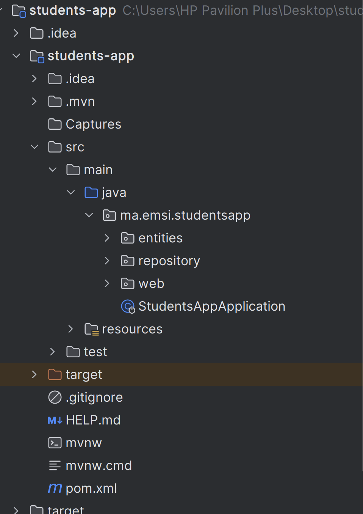
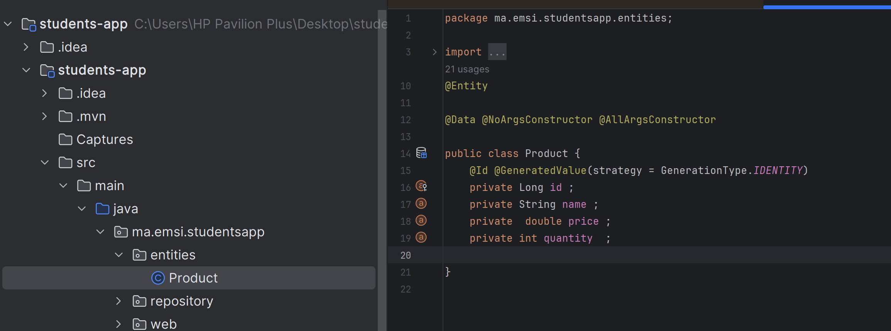
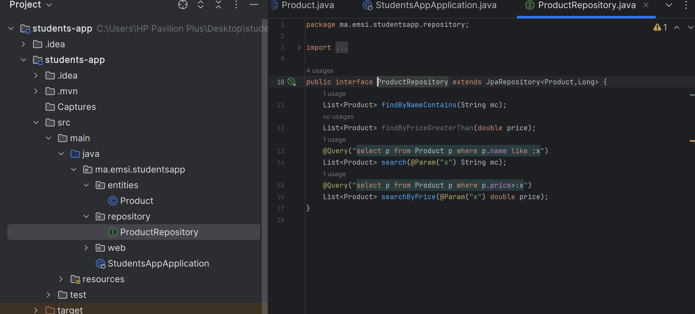
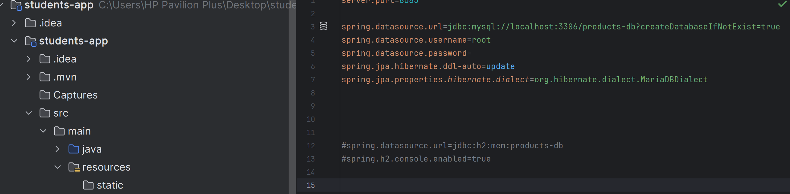
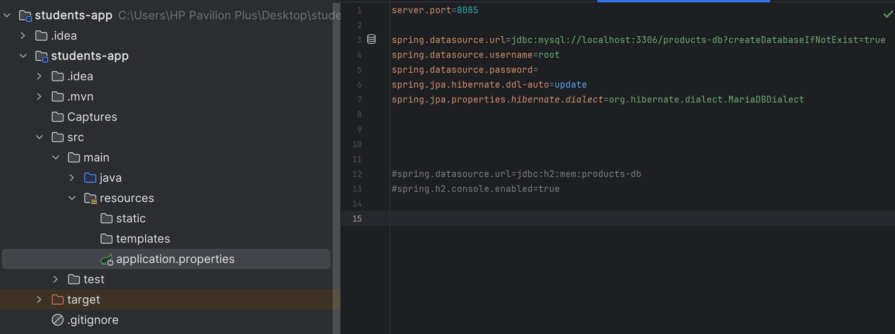
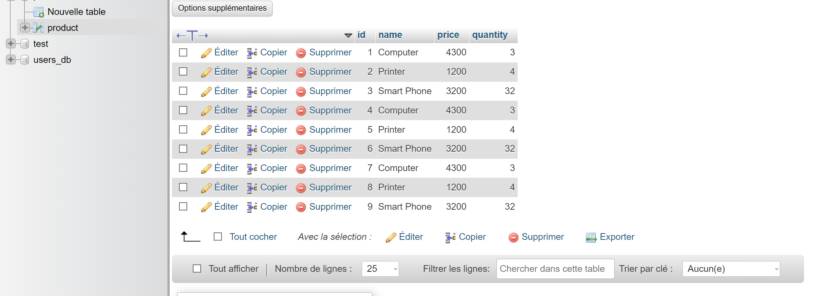

<h3>Structure du projet : </h3>

1. Créer les differentes classes 
   
2. Création des interfaces  
   
3. la liaison avec la BD 
   
4. PRESENTATION DE LA BD 
   
5. EXAMPLAIRE : 
   

6. RUN DU PROJET 
   